# 3D Geological Modeling and Analysis Project

[](https://www.python.org/downloads/)
[](https://jupyter.org/)
[](https://opensource.org/licenses/MIT)
[](https://trimsh.org/)

> **A comprehensive 3D geological modeling and analysis toolkit for rock mass characterization, optimal block extraction, and interactive visualization.**

## 🌟 Project Overview

This project implements a comprehensive data science and machine learning pipeline focused on **3D geological modeling and analysis**. The pipeline simulates and analyzes geological structures, specifically focusing on the slicing of rock formations (referred to as 'stones') by discontinuities and the subsequent volumetric and spatial analysis of the resulting segments.

**Key Innovation**: Advanced geometric algorithms for optimal rectangular block extraction from irregular geological segments, with real-time interactive visualization and efficiency optimization.

## ✨ Key Features

- 🗿 **3D Geological Modeling**: Advanced rock mass analysis with discontinuity handling
- 📐 **Optimal Block Extraction**: Rectangular block generation with maximum material utilization
- 🎯 **Interactive Dashboards**: Real-time 3D visualization with dynamic parameter controls
- 📊 **Volume Analysis**: Comprehensive efficiency metrics and statistical analysis
- 🔄 **Multi-method Processing**: Comparison of Trimesh and Open3D voxelization approaches
- 📈 **Rotation Optimization**: Automated orientation finding for maximum efficiency
- 💾 **Data Export**: Excel integration for geological data import/export

## 📁 Project Structure

```
3DStone/
├── 📖 README.md              # Comprehensive project documentation
├── 📊 CutStone.ipynb        # 🌟 Main comprehensive analysis notebook
├── 📋 discontinuities.xlsx          # Input geological discontinuity data
├── 📈 Comprehensive_3D_Geological_Modeling.ipynb  # Additional modeling approaches
└── 🗂️ outputs/               # Generated results and visualizations
```

## 🎯 Main Notebook: CutStone.ipynb

**The comprehensive, production-ready geological modeling solution.**

### 🚀 Core Capabilities

**🏗️ 3D Geological Processing**
- Advanced mesh slicing with geological discontinuities
- Volume calculation using convex hull algorithms
- Multi-segment generation with spatial analysis

**📐 Optimal Block Extraction**
- 2D polygon extraction from 3D geological segments
- Rectangular fishnet generation using Shapely
- 3D extrusion with boolean intersection operations
- Rotation optimization for maximum material utilization

**🎮 Interactive Visualization**
- Real-time parameter adjustment with sliders
- Dynamic segment selection and analysis
- Multiple view modes (packed/unpacked blocks)
- Transparency controls for interior visualization
- Component toggles for selective display

**📊 Advanced Analytics**
- Volume efficiency calculations
- Statistical analysis and reporting
- Multi-method voxelization comparison
- Performance optimization metrics

## Notebooks Description

### 1. Trimesh.ipynb - Primary Geological Modeling
**Purpose**: Core geological modeling functionality using iterative vertex-based slicing.

**Key Features**:
- Stone class with geological discontinuity handling
- Manual vertex classification and intersection calculation
- Volume analysis using scipy.spatial.ConvexHull
- 3D visualization with matplotlib and color-coding by volume
- Export functionality to Excel format

**Key Results**:
- Successfully processes 12 geological discontinuities
- Generates 14 geological segments with volumes ranging from 0.00 to 29.61 cubic units
- Exports detailed segment data to `segments.xlsx`
- Creates volume-based color visualizations (red: <20, yellow: 20-25, green: >25)

### 2. CutStone.ipynb - Advanced Geometric Operations & Interactive Dashboard
**Purpose**: Extended functionality with advanced geometric operations and comprehensive interactive visualizations.

**Key Features**:
- **2D Polygon Extraction**: Projects 3D segments to 2D for optimized analysis
- **Fishnet Generation**: Creates optimal rectangular block arrangements using Shapely
- **3D Extrusion & Boolean Operations**: Converts 2D fishnets to 3D blocks with trimesh intersections
- **Optimal Rotation Analysis**: Finds best orientations to maximize voxelization efficiency
- **Enhanced Interactive Dashboard**: Real-time visualization with dynamic controls
- **Open3D Integration**: Advanced 3D processing and point cloud voxelization
- **Multi-method Voxelization**: Compares Trimesh and Open3D voxelization approaches

**Enhanced Interactive Dashboard Features**:
- **Real-time Controls**: Dynamic sliders for cube dimensions (width, height, depth)
- **Segment Selection**: Interactive segment picker with volume information
- **View Modes**: Toggle between "packed" (blocks inside segments) and "unpacked" (separated blocks)
- **Transparency Control**: Adjustable segment transparency to reveal interior structure
- **Component Toggles**: Show/hide original stone, segments, and optimal blocks independently
- **Statistical Display**: Real-time efficiency metrics and volume calculations
- **Optimized Layout**: Rectangular aspect ratios for accurate geometric representation
- **Rich Annotations**: Hover details for volumes, dimensions, and coordinates

**Advanced Capabilities**:
- Converts 3D segments to 2D polygons with convex hull analysis
- Generates and optimizes rectangular grids within irregular geological shapes
- Performs 3D boolean intersections for precise block extraction
- Implements rotation optimization algorithms for maximum material utilization
- Creates comprehensive interactive dashboards with multiple visualization modes
- Provides volume efficiency analysis with real-time feedback

## 📈 Data Pipeline

```mermaid
graph LR
    A[📊 discontinuities.xlsx] --> B[🗿 3D Stone Model]
    B --> C[✂️ Discontinuity Slicing]
    C --> D[📐 Segment Generation]
    D --> E[🔄 2D Projection]
    E --> F[🎯 Fishnet Optimization]
    F --> G[📦 3D Block Extraction]
    G --> H[📊 Interactive Dashboard]
    H --> I[📈 Results Export]
```



1. **📊 Data Collection**: Import geological discontinuity parameters from Excel
2. **🗿 Preprocessing**: Create 3D stone model with realistic dimensions
3. **✂️ Feature Engineering**: Slice stone using geological discontinuities
4. **📐 Modeling**: Generate segments and calculate geometric properties
5. **🔄 Optimization**: Apply rotation and fishnet algorithms
6. **📊 Evaluation**: Create interactive visualizations and export results

## 🎯 Applications

### 🏗️ Engineering Applications
- **Geotechnical Engineering**: Rock mass characterization and stability analysis
- **Mining Engineering**: Ore body fragmentation and extraction planning
- **Construction Materials**: Optimal block cutting for building projects
- **Quality Control**: Volume efficiency analysis in stone processing

### 🔬 Research Applications  
- **Computational Geometry**: 3D modeling and optimization algorithms
- **Geological Modeling**: Discontinuity analysis and spatial statistics
- **Educational Tools**: Teaching 3D analysis and visualization techniques
- **Material Science**: Block extraction efficiency studies

### 🏭 Industrial Applications
- **Stone Processing**: Maximize material utilization in quarrying
- **Resource Assessment**: Volume estimation and spatial analysis
- **Automation**: Optimal cutting pattern generation
- **Process Optimization**: Real-time efficiency monitoring

## 🛠️ Technology Stack

| Component | Technology | Purpose |
|-----------|------------|---------|
| **Core 3D Processing** |  | Mesh operations, slicing, boolean operations |
| **Numerical Computing** |  | 3D geometry and mathematical operations |
| **2D Geometry** |  | Polygon manipulation and fishnet generation |
| **Advanced 3D** |  | Point cloud processing and voxelization |
| **Interactive Viz** |  | Real-time 3D dashboards and controls |
| **Data Processing** |  | Excel I/O and statistical analysis |
| **Scientific Computing** |  | Spatial operations and optimization |

## 📦 Installation

### Quick Start
```bash
# Clone the repository
git clone https://github.com/sepehrkdi/3DStone.git
cd 3DStone

# Install dependencies
pip install -r requirements.txt

# Launch Jupyter Lab
jupyter lab
```

### Requirements
```txt
numpy>=1.21.0
trimesh>=3.15.0
pandas>=1.3.0
scipy>=1.7.0
matplotlib>=3.5.0
shapely>=1.8.0
open3d>=0.15.0
plotly>=5.0.0
openpyxl>=3.0.0
jupyter>=1.0.0
ipywidgets>=7.6.0
mapbox-earcut>=1.0.0
triangle>=20220202
```

### System Requirements
- **Python**: 3.8 or higher
- **Memory**: 4GB RAM minimum (8GB recommended for large datasets)
- **GPU**: Optional (accelerates Open3D operations)
- **Browser**: Modern browser with WebGL support for Plotly visualizations

## Results Summary

### Geological Analysis Results:
- **Total Segments Generated**: 14 distinct geological fragments
- **Total Volume Analyzed**: 187.82 cubic units
- **Volume Range**: 0.00 - 29.61 cubic units
- **Segment Categories**:
  - Small segments (< 20 units): 11 segments
  - Medium segments (20-25 units): 1 segment
  - Large segments (> 25 units): 2 segments

### Advanced Analysis Capabilities:
- **2D Fishnet Optimization**: Generates optimal rectangular block arrangements within irregular segments
- **3D Block Extraction**: Creates precise rectangular blocks through boolean intersection operations
- **Volume Efficiency Analysis**: Calculates extraction efficiency percentages for different cutting strategies
- **Interactive Visualization**: Real-time parameter adjustment with immediate visual feedback
- **Multi-method Voxelization**: Compares Trimesh and Open3D approaches for optimal results
- **Rotation Optimization**: Finds optimal orientations to maximize material utilization

### Output Files:
- **segments.xlsx**: 243 data points with segment IDs, volumes, colors, and coordinates
- **Interactive dashboards**: Real-time 3D visualizations with dynamic controls
- **Volume analysis charts**: Histograms, efficiency plots, and statistical summaries
- **3D models**: Trimesh scenes with color-coded geological segments and optimal blocks
- **Fishnet visualizations**: 2D polygon analysis with rectangular block overlays

## 🚀 Quick Start Guide

### 1. Basic Usage
```python
# Import the main libraries
import trimesh
import numpy as np
import pandas as pd

# Load geological data
geological_data = pd.read_excel('discontinuities.xlsx')

# Run the complete analysis
# Open CutStone.ipynb and execute all cells
```

### 2. Interactive Dashboard
```python
# The notebook includes an interactive dashboard with:
# - Real-time parameter sliders
# - Segment selection dropdown
# - View mode toggles
# - Transparency controls
# - Statistical displays
```

### 3. Key Outputs
- **3D Visualizations**: Interactive geological segment models
- **Volume Analysis**: Efficiency metrics and statistical reports
- **Optimal Blocks**: Rectangular block arrangements within segments
- **Export Data**: Excel files with detailed analysis results

## 📊 Sample Results

### Geological Analysis Performance
- **Total Segments Generated**: 14 distinct geological fragments
- **Volume Range**: 0.00 - 29.61 cubic units
- **Extraction Efficiency**: Up to 85% material utilization
- **Processing Speed**: Real-time analysis for typical geological datasets

### Example Use Cases

**🏗️ Geotechnical Engineering**
```python
# Analyze rock mass stability
segments = analyze_geological_segments(stone_data)
stability_metrics = calculate_stability(segments)
```

**⛏️ Mining Optimization**
```python
# Optimize block extraction
optimal_blocks = generate_optimal_blocks(segments, target_dimensions)
efficiency = calculate_extraction_efficiency(optimal_blocks)
```

**🏭 Stone Processing**
```python
# Maximize material utilization
rotated_segments = find_optimal_rotation(segments)
rectangular_blocks = extract_rectangular_blocks(rotated_segments)
```

## Applications

This pipeline is valuable for:
- **Geotechnical Engineering**: Rock mass characterization, stability analysis, and optimal cutting strategies
- **Mining Engineering**: Ore body fragmentation, extraction planning, and block optimization
- **Geological Resource Assessment**: Volume estimation, spatial analysis, and resource quantification
- **Stone Processing Industry**: Optimal block extraction from quarried stone with maximum material utilization
- **Construction Materials**: Rectangular block generation for building and infrastructure projects
- **Research**: 3D geological modeling, discontinuity analysis, and computational geometry
- **Education**: Teaching geological modeling, 3D analysis techniques, and interactive visualization
- **Quality Control**: Volume efficiency analysis and cutting optimization in stone processing

## Future Enhancements

Potential improvements include:
- **Machine Learning Integration**: Automatic segment classification and optimal cutting pattern prediction
- **Real-time Processing**: Live geological data integration and dynamic analysis updates
- **Advanced Optimization**: Genetic algorithms for complex multi-objective cutting optimization
- **Integration Capabilities**: GIS systems, geological databases, and CAD software connectivity
- **Cloud Computing**: Scalable processing for large geological datasets
- **Mobile Applications**: Field-ready geological analysis tools with touch interfaces
- **AI-Powered Analysis**: Deep learning for geological pattern recognition and automation
- **Virtual Reality**: Immersive 3D geological exploration and analysis environments

## 🤝 Contributing

We welcome contributions! Please see our [Contributing Guidelines](CONTRIBUTING.md) for details.

### Development Setup
```bash
# Fork and clone the repository
git clone https://github.com/sepehrkdi/3DStone.git
cd 3DStone

# Create development environment
python -m venv venv
source venv/bin/activate  # or `venv\Scripts\activate` on Windows

# Install development dependencies
pip install -r requirements-dev.txt

# Run tests
pytest tests/
```

## 📄 License

This project is licensed under the MIT License - see the [LICENSE](LICENSE) file for details.

## 📧 Contact

- **Author**: [Sepehr Khodadadi](mailto:thisissepehrkhd@gmail.com)
- **Project Link**: [https://github.com/sepehrkdi/3DStone](https://github.com/sepehrkdi/3DStone)
- **Issues**: [Report a bug or request a feature](https://github.com/sepehrkdi/3DStone/issues)

## 🙏 Acknowledgments

- [Trimesh](https://trimsh.org/) community for excellent 3D processing tools
- [Open3D](http://www.open3d.org/) for advanced 3D computing capabilities
- [Plotly](https://plotly.com/) for interactive visualization framework
- Scientific Python ecosystem for foundational libraries

## 📚 Citations

If you use this project in your research, please cite:

```bibtex
@software{3dstone2024,
  author = {Sepehr Khodadadi},
  title = {3D Geological Modeling and Analysis Project},
  year = {2024},
  url = {https://github.com/sepehrkdi/3DStone}
}
```

---

⭐ **Star this repository** if you find it helpful for your geological modeling projects!

🔗 **Share** with colleagues working in geotechnical engineering, mining, or 3D analysis!
